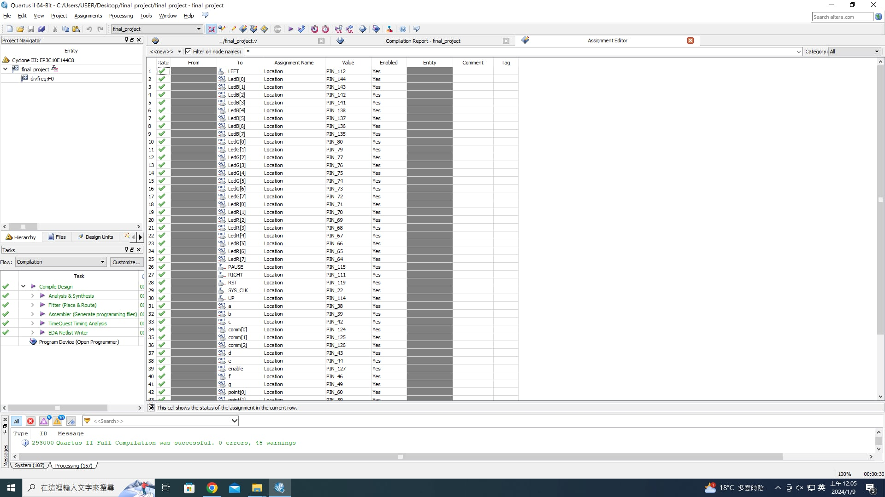

# fpga-final_project 貪食蛇
- - -
組員:
```
111321016 111321013
```
- - -
## 內容:
修改專案 https://github.com/vale5230/Snake-Game-in-FPGA
* 原功能
* 1.在8x8的LED全彩點矩陣上，隨機生成蛇的食物(會避開蛇的身體位置)
* 2.吃到紅點顯示得分
* 3.暫停功能 
* 4.超過8分就將蛇的身體變色 
- - -
## 增加功能:
* 1.隨著吃到的食物增加體長，每吃兩個 身體長度加1，上限是7(身體長度超過8，會變成一直線)
* 2.用七段顯示器16-bits LED顯示時間
* 3.增加難度 左右沒辦法吃到紅點，上下才行
- - -
## 功能影片:
* https://youtube.com/shorts/EamGJat3Qz8
- - -
## pin角



- - -
## 操作方式
使用4-bits Switch來控制方向，暫停的選項是8 DIPSW的紅色第3個開關
<table>
  <tr>
    <th>操控功能</th>
    <th>控制元件</th>
  </tr>
  <tr>
    <td>上</td>
    <td>S1</td>
  </tr>
  <tr>
    <td>下</td>
    <td>S2</td>
  </tr>
  <tr>
    <td>左</td>
    <td>S3</td>
  </tr>
  <tr>
    <td>右</td>
    <td>S4</td>
  </tr>
  <tr>
    <td>暫停</td>
    <td>紅色第3號</td>
  </tr>
</table>

